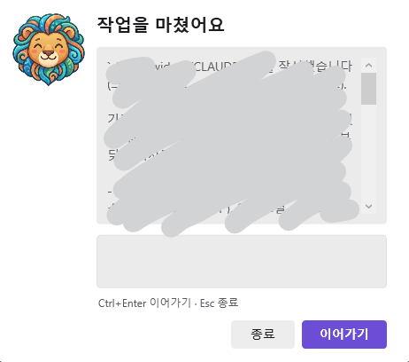

# 🦁 pawse

**English** · [한국어](#한국어)

> An interactive hook widget for Claude Code: when Claude **pauses**, the lion **Leo** peeks out so you can reply straight from a desktop popup.

When Claude finishes a task (Stop) or waits for your input (Notification), pawse shows a small desktop widget. **Type your next instruction right in the widget and Claude keeps going.** Built with PowerShell + WPF — **no install required** (Windows only).

> Optionally, pawse can also confirm risky commands before they run — see [Optional: PreToolUse](#optional-pretooluse-risky-command-confirm).

## Screenshots

| Stop — type your next instruction | Notification — Claude needs you |
|:--:|:--:|
|  |  |

## What each event does

| Event | Trigger | Widget | Leo |
|---|---|---|---|
| **Stop** | Claude finishes a response | Preview of the last message + an input box. Type to make Claude continue (`{"decision":"block"}`); leave it empty to just stop. | 😊 happy |
| **Notification** | Permission / idle input wait | Toast notification (auto-dismiss). Informational only. | 😮 surprised `!` |

> A third event, **PreToolUse** (risky-command confirm), is optional and off by default — see [Optional: PreToolUse](#optional-pretooluse-risky-command-confirm).

> **Design**: aligned with Windows 11 Fluent (8px card / 4px controls, soft shadow + 1px border, Segoe UI Variable type ramp 20/14/12, WCAG AA-passing colors), automatic light/dark following the system, and a slide-in entrance (respecting the system "Show animations" setting).

## How it works

The widget script is wired into Claude Code [hooks](https://code.claude.com/docs/en/hooks). The key idea is that it's **bidirectional**:

```
Claude finishes ─▶ Stop hook ─▶ pawse widget appears
                                     │  you type the next instruction
                                     ▼
       {"decision":"block","reason":"<your text>"}  ─▶ Claude continues
```

## Install

> **Windows only.** pawse uses `powershell.exe` + WPF. Installing on macOS/Linux is harmless but the widget won't appear.

### Recommended: install as a plugin

pawse ships as a Claude Code [plugin](https://code.claude.com/docs/en/plugins) — nothing to hand-edit. In Claude Code:

```text
/plugin marketplace add sinwoo0225/Pawse
/plugin install pawse@leo
```

Then run `/reload-plugins` (or restart Claude Code). The **Stop + Notification** hooks are wired automatically via `${CLAUDE_PLUGIN_ROOT}`.

### Manual install (fallback)

Prefer to wire it yourself? Clone the repo and add this to `hooks` in `~/.claude/settings.json`, replacing `<install-path>` with the absolute path to the repo. **Note the `plugin\` subfolder** — the script lives under `plugin/`:

```json
"hooks": {
  "Stop": [{ "hooks": [{ "type": "command", "timeout": 600,
    "command": "powershell.exe -NoProfile -ExecutionPolicy Bypass -File \"<install-path>\\plugin\\claude-widget.ps1\" -Event Stop" }] }],
  "Notification": [{ "hooks": [{ "type": "command", "timeout": 30,
    "command": "powershell.exe -NoProfile -ExecutionPolicy Bypass -File \"<install-path>\\plugin\\claude-widget.ps1\" -Event Notification" }] }]
}
```

Then **restart** Claude Code to load the hooks.

> WPF needs an STA thread, so it's invoked with **`powershell.exe`** (Windows PowerShell 5.1), not `pwsh`.

> **Upgrading from a pre-plugin manual install?** The script moved from the repo root into `plugin/`. Switch to the plugin install above, or update your `settings.json` hook path to add `\plugin`.

## Optional: PreToolUse (risky-command confirm)

Not part of the default install above — pawse can also pop a confirm widget right before a command runs. To turn it on, add a `PreToolUse` hook alongside the others:

```json
"PreToolUse": [{ "matcher": "Bash", "hooks": [{ "type": "command", "timeout": 600,
  "command": "powershell.exe -NoProfile -ExecutionPolicy Bypass -File \"<install-path>\\plugin\\claude-widget.ps1\" -Event PreToolUse" }] }]
```

Then set a `DangerPattern` regex in `config.psd1` to choose which commands trigger it (the shipped default `'.'` matches every command), and **restart** Claude Code.

### When does the PreToolUse widget appear?

Before a tool runs, the hook decides whether to show the confirm widget. It only shows when **all three gates** pass — otherwise it exits silently and Claude's normal permission flow continues:

```
        tool about to run
                │
                ▼
   ┌─────────────────────────────────────────────────────────┐   yes
   │ 1. permission_mode ∈ {auto, bypassPermissions, dontAsk}? │ ──────▶ exit 0  (no widget)
   └─────────────────────────────────────────────────────────┘
                │ no
                ▼
   ┌─────────────────────────────────────────────────────────┐   yes
   │ 2. command covered by a permissions.allow rule?          │ ──────▶ exit 0  (no widget)
   │    (Bash(...) form — the hook matcher is "Bash")         │
   └─────────────────────────────────────────────────────────┘
                │ no
                ▼
   ┌─────────────────────────────────────────────────────────┐   no
   │ 3. command matches DangerPattern?                        │ ──────▶ exit 0  (normal flow)
   │    (default config '.' ⇒ every command matches)          │
   └─────────────────────────────────────────────────────────┘
                │ yes
                ▼
        ╔══════════════════════════════╗
        ║   PreToolUse widget appears   ║
        ║   허용  /  직접 확인  /  차단   ║   (Allow / Ask / Block)
        ╚══════════════════════════════╝
                │
                ▼
   permissionDecision: allow / ask / deny  ─▶ Claude
```

- **Gate 1 (mode)**: `auto`/`bypassPermissions`/`dontAsk` proceed without asking, so the widget stays out of the way. It still appears in `default`/`plan`/`acceptEdits`.
- **Gate 2 (allowlist)**: mirrors `permissions.allow` from `~/.claude` and the project's `.claude` settings, so commands you already trust don't pop the widget. Approving "don't ask again" adds the rule automatically.
- **Gate 3 (DangerPattern)**: shipped as `'.'` (matches everything) for a *terminal-mirror* feel; set a real regex in `config.psd1` to limit the widget to risky commands only.

> Because the hook can't see Claude Code's *resolved* permission decision (only `tool_name` / `tool_input` / `permission_mode`), this is a best-effort mirror — session-only "allow once" approvals and the built-in safe-command classifier aren't visible to it.

## Configuration (`config.psd1`)

| Key | Description |
|---|---|
| `Sound` | Play a sound when the widget appears |
| `NotificationAutoCloseSeconds` | Toast auto-dismiss time (seconds) |
| `PreviewMaxChars` | Max chars for the Stop preview (`0` = unlimited) |
| `Mode` | `'auto'` (follow Windows light/dark) · `'light'` · `'dark'` |
| `Accent` / `AccentDark` | Light/dark accent (primary button & focus). Defaults pass WCAG AA (≥4.5:1) |
| `Animate` | Slide-in entrance. If omitted, follows the Windows "Show animations" setting (`$true`/`$false` to force) |
| `DangerPattern` | *(PreToolUse only)* Regex for which commands trigger the confirm widget; `'.'` matches every Bash command. Has no effect unless the optional PreToolUse hook is enabled |

`config.psd1` is read every time a widget appears, so changes apply **without restarting** Claude Code.

> **Installed as a plugin?** The bundled `config.psd1` lives in the plugin cache and is overwritten on update. On first run pawse copies it to the plugin's data folder (`${CLAUDE_PLUGIN_DATA}\config.psd1`); edit **that** copy — your settings then survive plugin updates. (Manual installs just edit `plugin/config.psd1` directly.)

## Changing the character (Leo)

The `plugin/assets/` folder contains Leo's three expressions (`stop.png`, `notification.png`, `pretooluse.png`). Replace them with your own **transparent PNGs** (square recommended) to change the character. Delete them to fall back to the built-in vector character. When installed as a plugin, drop your PNGs in `${CLAUDE_PLUGIN_DATA}\assets\` instead so they survive updates.

## Try it directly

```powershell
# Stop widget (type, continue → check JSON output)
'{"hook_event_name":"Stop","stop_hook_active":false,"transcript_path":""}' |
  powershell.exe -NoProfile -ExecutionPolicy Bypass -File .\plugin\claude-widget.ps1 -Event Stop

# Notification toast
'{"notification_type":"idle_prompt","message":"Waiting for input"}' |
  powershell.exe -NoProfile -ExecutionPolicy Bypass -File .\plugin\claude-widget.ps1 -Event Notification

# PreToolUse widget (optional event — risky command)
'{"tool_name":"Bash","tool_input":{"command":"rm -rf build"}}' |
  powershell.exe -NoProfile -ExecutionPolicy Bypass -File .\plugin\claude-widget.ps1 -Event PreToolUse
```

Logic only (no GUI): `powershell.exe -NoProfile -ExecutionPolicy Bypass -File .\plugin\test-widget.ps1`

## Details & limitations

- **Stop**: when the hook writes `{"decision":"block","reason":"<text>"}` to stdout, Claude resumes with that text as its next instruction. If `stop_hook_active` is true (already in a widget-triggered resume), the widget is skipped to avoid an infinite loop.
- **Notification** is informational only and can't answer permission prompts. (The optional PreToolUse widget can confirm commands — see [Optional: PreToolUse](#optional-pretooluse-risky-command-confirm).)
- While the widget waits for input, Claude waits too. If it exceeds `timeout` (seconds) the hook is killed and the widget closes, so **600** is recommended for Stop (and PreToolUse if enabled).
- All of stdin, stdout, transcript reads, and the script file are handled as UTF-8 so non-ASCII (e.g. Korean) doesn't break.

## Layout

| File | Role |
|---|---|
| `.claude-plugin/marketplace.json` | Self-hosted marketplace `leo` (lists the `pawse` plugin) |
| `plugin/.claude-plugin/plugin.json` | Plugin manifest |
| `plugin/hooks/hooks.json` | Stop + Notification hooks (wired via `${CLAUDE_PLUGIN_ROOT}`) |
| `plugin/claude-widget.ps1` | Single entry point; dispatches on `-Event Stop\|Notification\|PreToolUse` |
| `plugin/config.psd1` | User settings (bundled default — see the data-folder note in Configuration) |
| `plugin/assets/` | Leo expression PNGs (customizable) |
| `plugin/test-widget.ps1` | Dependency-free logic tests |
| `settings-hooks.snippet.json` | Manual-install hooks snippet (fallback) |

## License

MIT — see [LICENSE](LICENSE).

---

# 한국어

> Claude Code가 **멈출 때**(_pause_) 사자 **Leo**가 고개를 쏙 내미는, Claude Code용 양방향 hook 위젯.

Claude Code가 작업을 마치거나(Stop) 입력을 기다릴 때(Notification) 데스크톱에 작은 위젯을 띄우고, **그 위젯에서 바로 다음 지시를 입력**하면 Claude가 이어서 작업합니다. PowerShell + WPF로 만들어 **별도 설치가 필요 없습니다**(Windows 전용).

> 위험한 명령 실행 전 확인이 필요하면 선택 기능으로 켤 수 있습니다 — 아래 [선택: PreToolUse](#선택-pretooluse-위험-명령-확인) 참고.

## 이벤트별 동작

| 이벤트 | 트리거 | 위젯 | Leo |
|---|---|---|---|
| **Stop** | Claude가 응답을 마침 | 마지막 메시지 미리보기 + 입력창. 입력하면 Claude가 이어서 작업(`{"decision":"block"}`). 비워두면 그냥 종료. | 😊 웃음 |
| **Notification** | 권한/입력 대기(idle) | 토스트 알림(자동 닫힘). 정보 전용. | 😮 놀람 `!` |

> 세 번째 이벤트 **PreToolUse**(위험 명령 확인)는 선택 기능이며 기본 비활성 — 아래 [선택: PreToolUse](#선택-pretooluse-위험-명령-확인) 참고.

> **디자인**: Windows 11 Fluent 정합(8px 카드 / 4px 컨트롤, 부드러운 그림자 + 1px 테두리, Segoe UI Variable 타입램프 20/14/12, WCAG AA 통과 색), 시스템 라이트/다크 자동 전환, 등장 슬라이드인(시스템 "애니메이션 표시" 설정 존중).

## 동작 방식

Claude Code의 [hooks](https://code.claude.com/docs/en/hooks)에 위젯 스크립트를 연결합니다. 핵심은 **양방향**이라는 점 — Stop hook이 `{"decision":"block","reason":"<입력>"}`을 반환하면 그 입력이 Claude의 다음 지시가 되어 작업이 이어집니다.

## 설치

> **Windows 전용.** pawse는 `powershell.exe` + WPF를 쓰므로 Windows에서 동작합니다. mac/Linux에 설치해도 무해하지만 위젯은 뜨지 않습니다.

### 권장: 플러그인으로 설치

pawse는 Claude Code [플러그인](https://code.claude.com/docs/en/plugins)으로 배포되어 경로를 손볼 필요가 없습니다. Claude Code에서:

```text
/plugin marketplace add sinwoo0225/Pawse
/plugin install pawse@leo
```

이어서 `/reload-plugins`(또는 Claude Code 재시작). **Stop + Notification** hook이 `${CLAUDE_PLUGIN_ROOT}`로 자동 연결됩니다.

### 수동 설치 (fallback)

직접 연결하려면 저장소를 클론한 뒤 `~/.claude/settings.json`의 `hooks`에 위 영어 섹션의 JSON을 추가하세요. **`<install-path>`를 저장소 절대경로로 바꾸고, 스크립트가 `plugin\` 하위에 있음에 주의**(`...\plugin\claude-widget.ps1`). 그 후 Claude Code를 **재시작**하세요.

> WPF는 STA 스레드가 필요하므로 `pwsh`가 아니라 **`powershell.exe`**(Windows PowerShell 5.1)로 호출합니다.

> **플러그인 이전의 수동 설치에서 올라오나요?** 스크립트가 저장소 루트에서 `plugin/`으로 이동했습니다. 위 플러그인 설치로 전환하거나 `settings.json` hook 경로에 `\plugin`을 추가하세요.

## 선택: PreToolUse (위험 명령 확인)

기본 설치에는 포함되지 않습니다 — pawse는 명령 실행 직전에 확인 위젯을 띄울 수도 있습니다. 켜려면 다른 hook 옆에 `PreToolUse` hook을 추가하세요:

```json
"PreToolUse": [{ "matcher": "Bash", "hooks": [{ "type": "command", "timeout": 600,
  "command": "powershell.exe -NoProfile -ExecutionPolicy Bypass -File \"<install-path>\\plugin\\claude-widget.ps1\" -Event PreToolUse" }] }]
```

그리고 `config.psd1`의 `DangerPattern` 정규식으로 어떤 명령에 띄울지 정한 뒤(출고 기본값 `'.'`은 모든 명령에 매치) Claude Code를 **재시작**하세요.

### PreToolUse 위젯은 언제 뜨나

도구 실행 직전, hook이 **세 관문**을 모두 통과할 때만 확인 위젯을 띄웁니다. 하나라도 걸리면 조용히 종료(`exit 0`)하고 Claude의 평소 권한 흐름으로 넘어갑니다:

```
        도구 실행 직전
                │
                ▼
   ┌─────────────────────────────────────────────────────────┐   예
   │ 1. permission_mode 가 auto/bypassPermissions/dontAsk ?    │ ──────▶ exit 0  (위젯 없음)
   └─────────────────────────────────────────────────────────┘
                │ 아니오
                ▼
   ┌─────────────────────────────────────────────────────────┐   예
   │ 2. permissions.allow 규칙에 해당하는 명령인가?            │ ──────▶ exit 0  (위젯 없음)
   │    (Bash(...) 형식 — hook matcher 가 "Bash")              │
   └─────────────────────────────────────────────────────────┘
                │ 아니오
                ▼
   ┌─────────────────────────────────────────────────────────┐   아니오
   │ 3. DangerPattern 에 매치되는가?                          │ ──────▶ exit 0  (평소 권한 흐름)
   │    (기본 설정 '.' ⇒ 모든 명령이 매치)                    │
   └─────────────────────────────────────────────────────────┘
                │ 예
                ▼
        ╔══════════════════════════════╗
        ║   PreToolUse 위젯 표시         ║
        ║   허용  /  직접 확인  /  차단   ║
        ╚══════════════════════════════╝
                │
                ▼
   permissionDecision: allow / ask / deny  ─▶ Claude
```

- **관문 1 (모드)**: `auto`/`bypassPermissions`/`dontAsk`는 묻지 않고 진행하는 모드라 위젯이 끼어들지 않습니다. `default`/`plan`/`acceptEdits`에선 뜹니다.
- **관문 2 (allowlist)**: `~/.claude`와 프로젝트 `.claude` 설정의 `permissions.allow`를 미러링해, 이미 신뢰하는 명령엔 위젯이 안 뜹니다. "허용하고 다시 묻지 않기"를 고르면 규칙이 자동 추가됩니다.
- **관문 3 (DangerPattern)**: *터미널 미러* 느낌을 위해 기본값 `'.'`(모두 매치)로 출고됩니다. `config.psd1`에서 정규식을 지정하면 위험 명령에만 위젯을 띄울 수 있습니다.

> hook은 Claude Code의 *최종* 권한 결정은 못 보고(`tool_name`/`tool_input`/`permission_mode`만 받음), 그래서 이는 최선의 근사입니다 — "이번만 허용" 같은 세션 단위 승인과 내장 안전-명령 분류기는 hook에 보이지 않습니다.

## 설정 (`config.psd1`)

| 키 | 설명 |
|---|---|
| `Sound` | 위젯 등장 시 알림음 |
| `NotificationAutoCloseSeconds` | 토스트 자동 닫힘 시간(초) |
| `PreviewMaxChars` | Stop 미리보기 최대 글자 수(`0`이면 무제한) |
| `Mode` | `'auto'`(Windows 라이트/다크 따름) · `'light'` · `'dark'` |
| `Accent` / `AccentDark` | 라이트/다크 강조색(Primary 버튼·포커스). 기본값은 WCAG AA(≥4.5:1) 통과 |
| `Animate` | 등장 슬라이드인. 생략 시 Windows "애니메이션 표시" 설정을 따름(`$true`/`$false`로 강제) |
| `DangerPattern` | *(PreToolUse 전용)* 확인 위젯을 띄울 명령 정규식. 모든 Bash에 띄우려면 `'.'`. 선택 기능인 PreToolUse hook을 켜지 않으면 효과 없음 |

`config.psd1`은 위젯이 뜰 때마다 읽으므로 **Claude Code 재시작 없이** 반영됩니다.

> **플러그인으로 설치한 경우?** 번들 `config.psd1`은 플러그인 캐시에 있어 업데이트 시 덮어쓰입니다. pawse는 첫 실행 때 이를 플러그인 데이터 폴더(`${CLAUDE_PLUGIN_DATA}\config.psd1`)로 복사하므로, **그 사본**을 편집하면 설정이 플러그인 업데이트에도 보존됩니다. (수동 설치는 `plugin/config.psd1`을 직접 편집하면 됩니다.)

## 캐릭터(Leo) 바꾸기

`plugin/assets/` 폴더에 사자 Leo의 표정 3종(`stop.png`, `notification.png`, `pretooluse.png`)이 들어 있습니다. 원하는 **투명 PNG**(정사각형 권장)로 교체하면 캐릭터가 바뀝니다. 파일을 지우면 스크립트에 내장된 벡터 캐릭터가 대신 표시됩니다. 플러그인으로 설치했다면 업데이트에도 보존되도록 `${CLAUDE_PLUGIN_DATA}\assets\`에 PNG를 넣으세요.

## 동작 원리 / 한계

- **Stop**: hook이 `{"decision":"block","reason":"<입력>"}`을 stdout으로 반환하면 Claude가 그 지시로 작업을 재개합니다. `stop_hook_active`가 true면(이미 위젯이 유발한 재개 중) 위젯을 띄우지 않아 무한 루프를 막습니다.
- **Notification**은 정보 전용이라 권한을 직접 응답할 수 없습니다. (선택 기능인 PreToolUse 위젯으로 명령을 확인할 수 있습니다 — 위 [선택: PreToolUse](#선택-pretooluse-위험-명령-확인) 참고.)
- 위젯이 입력 대기로 떠 있는 동안 Claude는 기다립니다. `timeout`(초)을 넘기면 hook이 종료되고 위젯이 닫히므로 Stop은(켰다면 PreToolUse도) **600** 권장.
- 한글 등 비ASCII가 깨지지 않도록 stdin·stdout·트랜스크립트 읽기·스크립트 파일을 모두 UTF-8로 처리합니다.

---

<sub>made for Claude Code · PowerShell + WPF · Windows</sub>
